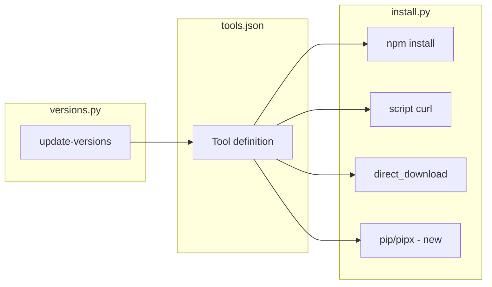

# Missing Coding LLM CLI Tools for code-aide

## Current Coverage

code-aide supports 6 tools with these install types:

| Install Type      | Tools                  | Mechanism                 |
| ----------------- | ---------------------- | ------------------------- |
| `direct_download` | Cursor                 | Tarball from URL template |
| `self_managed`    | Claude                 | npm + `claude upgrade`    |
| `npm`             | Gemini, Codex, Copilot | `npm install -g`          |
| `script`          | Amp                    | curl                      |

## Latest Release Dates (verified Feb 2026)

| Tool         | Package           | Latest Version | Last Published |
| ------------ | ----------------- | -------------- | -------------- |
| OpenCode     | opencode-ai       | 1.2.15         | 2026-02-26     |
| Kilo         | @kilocode/cli     | 7.0.33         | 2026-02-27     |
| Crush        | @charmland/crush  | 0.46.1         | 2026-02-27     |
| Continue CLI | @continuedev/cli  | 1.5.43         | 2026-02-02     |
| MeerAI       | meerai            | 0.6.21         | 2025-11-15     |
| Aider        | aider-chat (PyPI) | 0.86.2         | 2026-02-12     |
| Goose        | script install    | v1.26.1        | 2026-02-27     |

Note: OpenCode uses npm package `opencode-ai` (not @opencode-ai/cli). Kilo CLI
binary is `kilo` (from package bin).

## Missing Tools (Research Findings)

### Tier 0: Priority Additions (decided)

| Tool         | Command    | npm Package     | Latest | Notes                                                               |
| ------------ | ---------- | --------------- | ------ | ------------------------------------------------------------------- |
| **OpenCode** | `opencode` | `opencode-ai`   | 1.2.15 | 95K+ GitHub stars, 75+ LLM providers, LSP integration, Copilot auth |
| **Kilo**     | `kilo`     | `@kilocode/cli` | 7.0.33 | 500+ models, Memory Bank, Orchestrator mode, 35K weekly downloads     |

### Tier 1: Easy Additions (npm, fits existing patterns)

| Tool             | Command | npm Package        | Latest | Notes                                                        |
| ---------------- | ------- | ------------------ | ------ | ------------------------------------------------------------ |
| **Crush**        | `crush` | `@charmland/crush` | 0.46.1 | Charm Bracelet, 20K+ stars, multi-platform incl. Android     |
| **Continue CLI** | `cn`    | `@continuedev/cli` | 1.5.43 | TUI + headless modes, Node 18+                               |
| **MeerAI**       | `meer`  | `meerai`           | 0.6.21 | Local-first, 60+ LangChain tools, Node 20+ (stale: Nov 2025) |

All use `npm install -g` and would follow the same pattern as Gemini, Codex, and
Copilot in `src/code_aide/data/tools.json`.

### Tier 2: Requires New Install Type (pip/pipx)

| Tool      | Command | Install                                                   | Notes                                                     |
| --------- | ------- | --------------------------------------------------------- | --------------------------------------------------------- |
| **Aider** | `aider` | `pipx install aider-chat` or `uv tool install aider-chat` | 39K+ stars, 4.1M+ installs, model-agnostic, voice-to-code |

Aider is Python-based. code-aide would need a new `pip` or `pipx` install type.
AGENTS.md says "stdlib only" but npm is already invoked as an external tool, so
invoking `pipx` or `uv` would be consistent.

### Tier 3: Script-Based (fits existing script type)

| Tool      | Command | Install                                                                               |
|:----------|:--------|:--------------------------------------------------------------------------------------|
| **Goose** | `goose` | `curl -fsSL https://github.com/block/goose/releases/download/stable/download_cli.sh \ |

Would require SHA256 for the install script (like Amp). Need to verify script
URL and checksum.

### Tier 4: Out of Scope or Different Category

| Tool                     | Reason                                                                            |
| ------------------------ | --------------------------------------------------------------------------------- |
| **Warp**                 | Full terminal replacement (desktop app), not a standalone CLI; Oz CLI is embedded |
| **Cline**                | Primarily VS Code extension; terminal integration is secondary                   |
| **Augment, Droid, Kiro** | Enterprise-focused; install paths may be gated or custom                           |

## Recommended Implementation Order

1. **Tier 0 (OpenCode, Kilo)** — Add first. No architecture changes. Update
   `src/code_aide/data/tools.json`, run `update-versions` to fetch latest
   versions, add tests.
2. **Tier 1 (Crush, Continue CLI, MeerAI)** — Add as npm tools. Same pattern as
   Tier 0.
3. **Tier 2 (Aider)** — Add `pip` or `pipx` install type in
   `src/code_aide/install.py`, extend `src/code_aide/prereqs.py` for Python/pipx
   detection, add Aider to tools.json. Requires design choice: prefer `pipx`
   (isolated) or `uv tool install` (if uv is common in target users).
4. **Tier 3 (Goose)** — Add Goose as script-based tool once install script URL
   and SHA256 are verified.

## Data Flow for New Tools

## Key Files to Modify

- `src/code_aide/data/tools.json` — Add tool definitions
- `src/code_aide/install.py` — Add `pip`/`pipx` branch (for Aider)
- `src/code_aide/prereqs.py` — Python/pipx checks (for Aider)
- `src/code_aide/commands_actions.py` — Upgrade/remove logic for new install
  types
- `src/code_aide/detection.py` — Install method detection for pip tools

## Sources

- [Awesome Agents: 7 AI Coding CLI Tools Compared (Feb
  2026)](https://awesomeagents.ai/tools/best-ai-coding-cli-tools-2026/)
- [Tembo: 15 Coding CLI Tools Compared (Feb
  2026)](https://www.tembo.io/blog/coding-cli-tools-comparison)
- [Aider installation docs](https://aider.chat/docs/install.html)
- [OpenCode CLI docs](https://opencode.ai/docs/cli/)
- [Crush GitHub](https://github.com/charmbracelet/crush)
- [Continue CLI docs](https://docs.continue.dev/cli/install)
- [MeerAI](https://meerai.dev/)
- [Kilo CLI docs](https://kilo.ai/docs/cli)
- [Goose installation](https://block.github.io/goose/)
